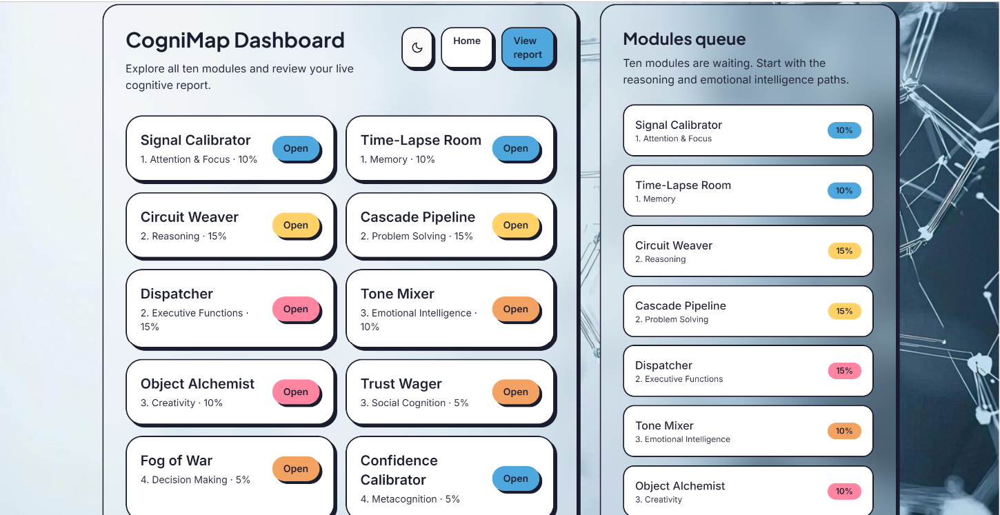
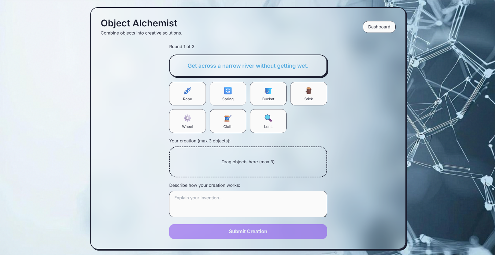
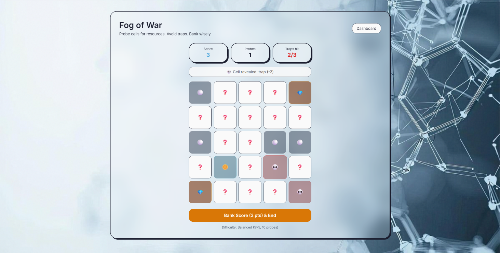
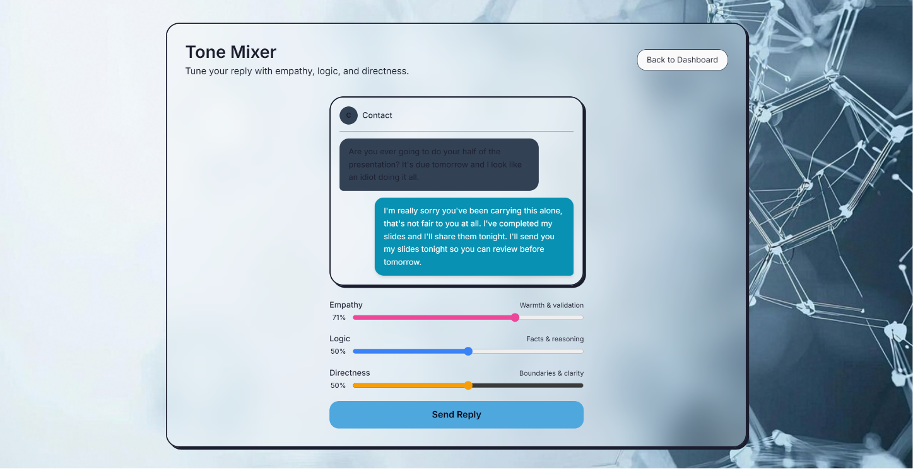
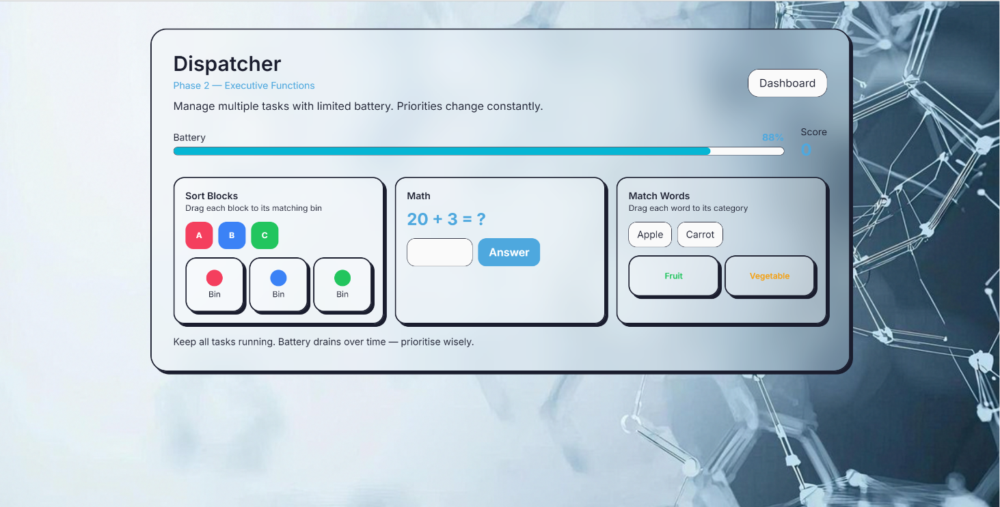
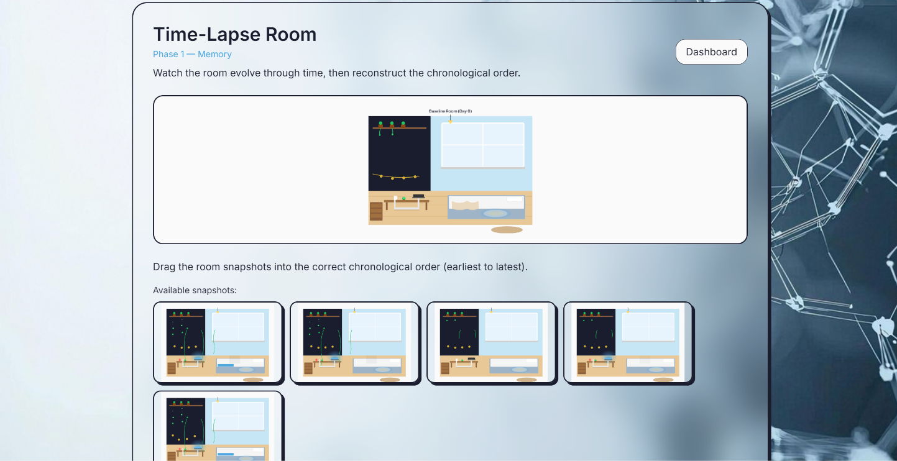
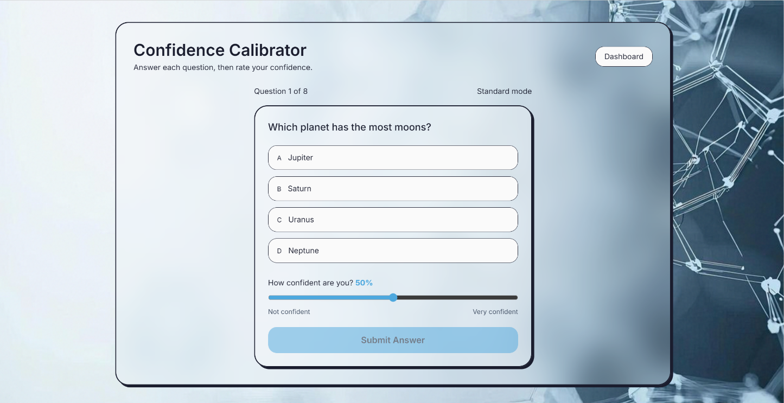
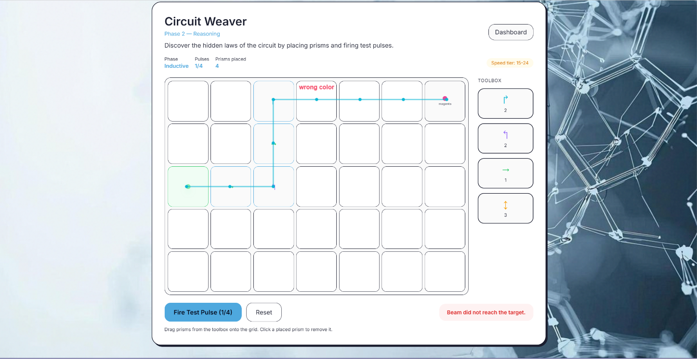
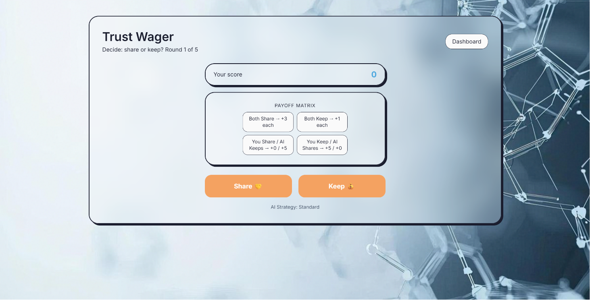

# CogniMap

AI-powered human cognitive pattern analyzer.

## Output Images



| Module | Output |
| --- | --- |
| Attention & Focus |  |
| Creativity |  |
| Decision Making |  |
| Emotional Intelligence |  |
| Executive Functions |  |
| Memory |  |
| Metacognition Confidence |  |
| Reasoning |  |
| Social Cognition |  |

## Backend

1. Create a Python virtual environment if needed:
   ```bash
   python -m venv .venv
   .\.venv\Scripts\activate
   ```
2. Install dependencies:
   ```bash
   pip install -r backend/requirements.txt
   ```
3. Run the backend:
   ```bash
   cd backend
   ..\.venv\Scripts\uvicorn app.main:app --reload --port 8000
   ```

## Frontend

1. Install dependencies from the frontend folder:
   ```bash
   cd frontend
   npm install
   ```
2. Run the development server:
   ```bash
   npm run dev
   ```

## Notes

- The backend is configured to use `DATABASE_URL` from environment variables.
- The React frontend sends telemetry batches to `http://localhost:8000/api/telemetry/batch`.
- The current implementation includes the dashboard, the ten module flow, telemetry buffering, and live report generation.

## Docker & PostgreSQL

1. Start the full stack with Docker Compose:
   ```bash
   docker compose up --build
   ```
2. The frontend will be available at `http://localhost:5173` and the backend at `http://localhost:8000`.
3. PostgreSQL is exposed on port `5432` with credentials:
   - user: `postgres`
   - password: `postgres`
   - database: `cognimap`

## Backend local startup

1. Copy `backend/.env.example` to `backend/.env` and update if needed.
2. Run:
   ```bash
   cd backend
   ..\.venv\Scripts\uvicorn app.main:app --reload --port 8000
   ```

## Frontend local startup

1. Run:
   ```bash
   cd frontend
   npm run dev
   ```
